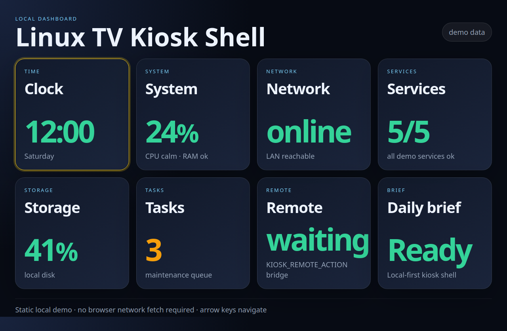

# Linux TV Kiosk Shell

[](https://github.com/YURII-YURII86/linux-tv-kiosk-shell/actions/workflows/ci.yml)
[](LICENSE)

A lightweight vanilla HTML/CSS/JS shell for TV dashboards, Linux kiosks, signage screens, and local appliance panels.



No React. No Electron. No build step. No cloud requirement.

```text
static index.html
  + src/shell.js
  + src/shell.css
  + data/shell-config.js
  + data/live.example.js
        ↓
Firefox/Chromium kiosk mode on weak Linux hardware
```

## Why this exists

Weak kiosk devices often do not need a heavy SPA. They need a stable full-screen shell that can be controlled by a remote, keyboard, or local input daemon, displays bounded cards, opens modal details, and reads already-prepared local data.

This project gives you that starting point.

## Features

- Vanilla static files.
- TV-first focus grid.
- Arrow/Enter/Escape keyboard navigation.
- Optional remote action bridge via `window.KIOSK_REMOTE_ACTION`.
- Card manifest from `window.KIOSK_SHELL_CONFIG`.
- Local live data via `window.KIOSK_LIVE`.
- Modal detail view.
- Bounded card text and responsive TV layout.
- Dependency-free DOM smoke tests for render/focus/modal/remote actions.
- Visual/static smoke tests.
- No network fetches from the browser by default.

## Quick start

Open directly:

```bash
python3 -m http.server 8080
```

Then open:

```text
http://127.0.0.1:8080/
```

Or use a browser in kiosk mode:

```bash
chromium --kiosk http://127.0.0.1:8080/
```

## Data model

Config lives in:

```text
data/shell-config.js
```

Live data example lives in:

```text
data/live.example.js
```

A backend/updater can overwrite a generated `data/live.js` with the same shape and `index.html` can be changed to load it instead.

## Remote control integration

The shell can consume actions like:

```js
window.KIOSK_REMOTE_ACTION = { seq: 1, action: "down" };
```

Supported actions:

- `up`
- `down`
- `left`
- `right`
- `center`
- `back`
- `home`
- `menu`

It pairs naturally with `xiaomi-mitv-remote-linux-kiosk`, but does not require it.

## Browser demo screenshot

A browser-rendered screenshot is committed at:

```text
docs/assets/dashboard-demo.png
```

Re-capture it locally when Chromium/Chrome is available:

```bash
./scripts/capture_demo_screenshot.sh
```

See `docs/demo.md`.

## Runtime validation

The repo includes a dependency-free Node DOM harness:

```bash
node tests/dom_smoke.js
```

It executes the real `src/shell.js` against demo config/live data and validates card rendering, focus movement, modal open/close, and `window.KIOSK_REMOTE_ACTION` remote bridge behavior.

## Documentation

- `docs/config.md` — shell config contract.
- `docs/focus-model.md` — TV/remote navigation model.
- `docs/integration.md` — local data and remote bridge integration.
- `docs/performance.md` — weak-device constraints.
- `docs/validation.md` — static, contract, and DOM validation.
- `docs/demo.md` — browser screenshot and re-capture instructions.
- `examples/integration/xiaomi-mitv-remote/` — remote input bridge example.
- `examples/integration/live-data-updater/` — local live data updater example.

## Repository quality gate

Run publication-readiness checks locally:

```bash
./scripts/repo_quality_gate.sh
```

The gate verifies static checks, contract checks, DOM smoke behavior, docs sections, local Markdown links, privacy/publication cleanliness, and CI workflow hygiene.

## Test

```bash
./scripts/smoke_test.sh
```

## Current verification status

Verified in this standalone repo:

- static file presence;
- config/live JS parseability;
- HTML contract checks;
- shell source syntax check through Node;
- contract checks for demo config/live files;
- DOM smoke checks for render/focus/modal/remote bridge behavior;
- committed browser screenshot dimensions/asset check;
- fresh-clone smoke tests;
- GitHub Actions CI.

Not yet verified on a real TV kiosk device after extraction.

## Part of Linux Kiosk Stack

This project is one layer of the [Linux Kiosk Stack](https://github.com/YURII-YURII86/linux-kiosk-stack): a local-first toolkit for Linux TV kiosks, dashboards, signage screens, and appliance panels.

## Roadmap

- Theme presets.
- More card renderer types.
- Optional generated catalog from `local-dashboard-widget-sdk`.
- GIF/video walkthrough.
- Optional Playwright visual gate.

## License

MIT.
